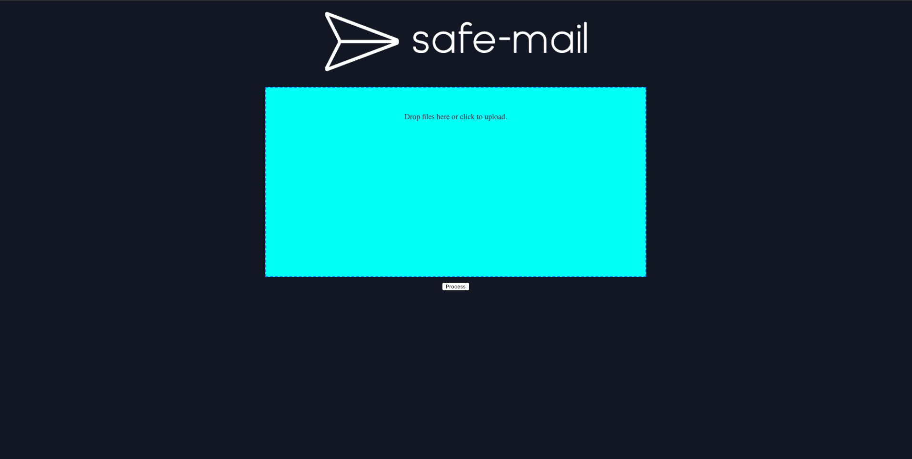
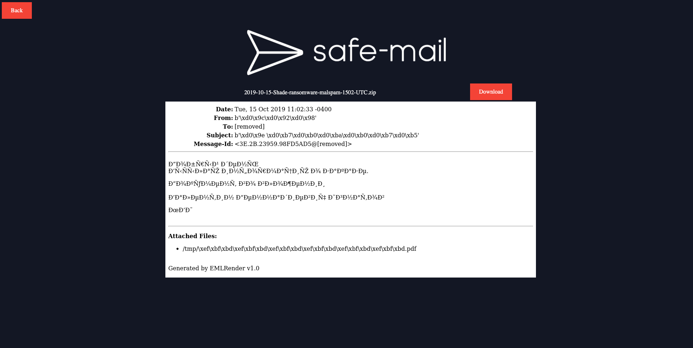

> safe-mail is a Docker service to help security teams safely interact with msg, eml, and documents

## Synopsis

safe-mail is a Docker service used by analysts to upload, extract, and inspect suspicious .MSG, .EML, and documents.  safe-mail can be used locally on your workstation or can be deployed for shared (or dedicated) use.

safe-mail an API and a (limited) UI which allows a user to upload and retrieve artifacts generated by safe-mail.

safe-mail has the following features and functionality:

### Message Features

* Upload EML and MSG mail messages as well as Microsoft Office documents themselves
   * .MSG mail messages are Microsoft binary email format messages - typically from Microsoft Outlook clients
* Generates a PNG of the message itself named {file_name}.png
* Extracts all embedded & attached images/attachments within the email message
* Provides a OCR text file of the generated mail message
* Generates a JSON file representing the mail message headers

### Attachment/Document Features

* Extracts attachments of mail messages 
* Generates an image & PDF of each attachment
* Attempts to extract any identified Macros within attachments and creates a JSON file representing the Macro code base
* PDF Documents will generate output from [pdfid](https://blog.didierstevens.com/2009/03/31/pdfid/) & [pdfparser](https://blog.didierstevens.com/programs/pdf-tools/) tools
* ZIP attachments will extract the zip and return any files within the zip


### Output

> All of the above data (if applicable) will be returned in a file named `{file_name}.zip` 

## Installation

First you can download safe-mail by cloning the repository:

```bash
git clone git@github.com:swimlane/safe-mail.git
```

## Building Docker Image

You first need to build the Docker image:

```bash
docker build --force-rm -t safe-mail .
```

## Running the Docker Image

You can run the docker image using the following command:

```bash
docker run -p 7001:7001 -ti safe-mail 
```

## USAGE

You can use this docker image to upload via the API or the minimal front-end

### Using the Front End



You can upload files using the front-end by dragging and dropping or uploading by select the drag and drop zone.

You can access this front-end at the provided port number you selected when running the container.  

```
http://0.0.0.0:7001
```

Once the files are uploaded, you can then select to process the files using the `Process` button.  You will be redirected to another page which may contain a generated image of the uploaded file.  Additionally, you will see a `Download` button which you can then download all the generated and extracted information in a .zip file. This will return a `{file_name}.zip` file which contains the processed items details.




### Using the API

You can also upload mail messages (MSG & EML) and documents (see list below) using the API.

#### Uploading MSG Files

```python
import requests
import os

path = './my_message.msg'
outpath = './Downloads/output.zip'

url = 'http://0.0.0.0:7001/email'

files = {'file': open(path, 'rb')}
data = {'extension': 'msg'}
res = requests.post(url, files=files, data=data)
f = open(outpath, 'w+')
f.write(res.content)
```

#### Uploading EML Files using Python

```python
import requests
import os

path = './my_message.eml'
outpath = './Downloads/output.zip'

url = 'http://0.0.0.0:7001/email'

files = {'file': open(path, 'rb')}
data = {'extension': 'eml'}
res = requests.post(url, files=files, data=data)
f = open(outpath, 'w+')
f.write(res.content)
```

#### Uploading EML Files using PowerShell

```powershell
$inFile = './tests/files/'
$inFileName = 'Phish Test - 1.eml'
$outFile = 'output.zip'
$URL = 'http://localhost:7001/email'

$fileBytes = [System.IO.File]::ReadAllBytes($inFile + $inFileName);
$fileEnc = [System.Text.Encoding]::GetEncoding('UTF-8').GetString($fileBytes);
$boundary = [System.Guid]::NewGuid().ToString(); 
$LF = "`r`n";

$bodyLines = ( 
    "--$boundary",
    "Content-Disposition: form-data; name=`"file`"; filename=`"$($inFileName)`"",
    "Content-Type: application/octet-stream$LF",
    $fileEnc,
    "--$boundary--$LF" 
) -join $LF

Invoke-RestMethod -Uri $URL -Method Post -ContentType "multipart/form-data; boundary=`"$boundary`"" -Body $bodyLines -OutFile $outFile
```

##### Upload Documents & Files

```python
import requests
import os

path = './my_doc.docm'
outpath = './Downloads/output.zip'

url = 'http://0.0.0.0:7001/document'

files = {'file': open(path, 'rb')}
data = {'extension': 'docm'}
res = requests.post(url, files=files, data=data)
f = open(outpath, 'w+')
f.write(res.content)
```

## Supported Extensions

You can upload both MSG & EML files to either the front-end or to the `email` endpoint using the API.

Additionally, if you are using the `document` endpoint (or the UI front-end) safe-mail currently supports the following extensions but can possibly support additional files with testing.

* doc
* dot
* wbk
* docx
* docm
* dotx
* dotm
* docb
* xls
* xlt
* xlm
* xlsx
* xlsm
* xltx
* xltm
* xlsb
* xla
* xlam
* xll
* ppt
* pptx


## Running the tests

Tests within this project should cover all available properties and methods.  As this project grows the tests will become more robust but for now we are testing that they exist and return outputs.

## Contributing

Please read [CONTRIBUTING.md](https://github.com/swimlane/safe-mail/blob/master/CONTRIBUTING.md) for details on our code of conduct, and the process for submitting pull requests to us.

## Versioning

We use [SemVer](http://semver.org/) for versioning. 

## Change Log

Please read [CHANGELOG.md](https://github.com/swimlane/safe-mail/blob/master/CHANGELOG.md) for details on features for a specific version of `safe-mail`

## Authors

* Josh Rickard - *Initial work* - [MSAdministrator](https://github.com/msadministrator)

See also the list of [contributors](https://github.com/swimlane/safe-mail/contributors) who participated in this project.

## License

This project is licensed under the MIT License - see the [LICENSE](https://github.com/swimlane/safe-mail/blob/master/LICENSE.md) file for details


## Notes
```yaml
   Name: safe-mail
   Created by: Josh Rickard
   Created Date: 02/25/2020
```